# Padrões de Projeto GOF (23)

Em Engenharia de Software, um padrão de projeto (design pattern) é uma solução geral para um problema que ocorre com frequência dentro de um determinado contexto no projeto de software. Um padrão de projeto não é um projeto finalizado que pode ser diretamente transformado em código fonte ou de máquina, ele é uma descrição ou modelo (template) de como resolver um problema que pode ser usado em muitas situações diferentes. Padrões são boas práticas formalizadas que o programador pode usar para resolver problemas comuns ao projetar uma aplicação ou sistema **e principalmente promover o fraco acoplamento e a reutilização de código**. Um padrão de projeto define: seu nome, o problema, quando aplicar esta solução e suas consequências.
  
- Classificação por Finalidade
    - **Padrões de Criação** (5): tratam da definição de classes criadoras de objetos com o objetivo de abstrair a complexidade da criação e separar a rotina de criação de um objeto de sua representação ou de adiar o processo de criação.
        - Singleton
        - Factory Method (Método Fábrica)
        - Abstracty Factory (Classe Fábrica)
        - Builder (Classe Construtora)
        - Prototype
    - **Padrões Estruturais** (7): tratam das composições/associações entre classes.
        - Facade (Classe Fachada)
        - Adapter
        - Proxy
        - Composite
        - Flyweight
        - Bridge (Ponte)
        - Decorator
    - **Padrões Comportamentais** (11): tratam da divisão de responsabilidades na definição de classes.
        - Visitor
        - Command
        - Template Method
        - Strategy/Policy(Política)
        - Observer        
        - Mediator (Mediador/Moderador)
        - Memento
        - State (Estado)
        - Chain of Responsibility (Cadeia de Responsabilidades)
        - Iterator
        - Interpreter (Interpretador de Linguagem)

--- 

**Singleton**  

> **Intenção**: garantir que uma classe tenha somente uma instância e forneça somente um ponto global de acesso para a mesma.  

Para isso devemos definir uma classe com o construtor privado, um atributo estático privado e somente leitura do mesmo tipo da classe para guardar a instância e um método estático público que retorna a única instância da classe.

**Factory Method** (Método Fábrica)  

> Intenção: definir uma interface para criar um objeto, mas deixar as subclasses decidirem que classe instanciar. O Factory Method permite adiar a instanciação para subclasses.

O Factory Method ajuda a tirar o **new** da classe cliente e com isso ajuda a dimiuir o acoplamento. _Toda vez que usamos o **new** estamos promovendo acoplamento (dependência) e o ideal é evitar que uma classe ou um método fiquem fortemente acoplados._

A ideia é adiar a instanciação às subclasses e passar o acoplamento para métodos utilitários criadores.

Podemos utilizar o padrão na íntegra, conforme definido por GOF, que consiste na definição de um método criador abstrato em uma classe abstrata de criação. Isso nos obriga a estender e a implementar, o que torna a rotina de criação mais flexível. Porém podemos utilizar uma estratégia (que não é um padrão) chamada de **SimpleFactory** que consiste na simples definição de uma classe criadora com um método criador concreto que devolve uma instância com base em parâmetros recebidos e em decisões internas. Essa estratégia, por ser mais simples, é muito usada, mas não é um padrão GOF e sim uma derivação deste.

No caso do padrão proposto por GOF, como se propõe a definição de um método abstrato, o correto é que o método abstrato Factory Method também faça referência (fique acoplado) a classes abstratas, deixando o acomplamento concreto para classes concretas.

Este padrão é muito utilizado em conjunto ao padrão Singleton para gerenciar a instanciação de conexões.

**Abstract Factory** (Classe Fábrica)

> Intenção: fornecer uma interface para criação de famílias de objetos relacionados ou dependentes sem especificar suas classes concretas.

A classe fábrica (AbstractFactory) não conhece os objetos concretos. Ela apenas fornece um contrato único entre a classe cliente e várias classes fábricas concretas que estendem/implementam a AbstractFactory.

Encontramos esse padrão no .NET nas seguintes classes:

**Builder**  

> Intenção: separar a construção de um objeto complexo de sua representação de modo que o mesmo processo de construção possa criar diferentes representações.

A ideia é quebrar a rotina de criação de um objeto complexo em vários métodos e colocar entre Cliente e o Objetivo uma classe Builder (construtora).

O Android SDK utiliza uma variação (mais simples e mais prática) deste padrão, que podemos chamar de **SimpleBuilder**. Um exemplo é a criação de uma notificação. Para obter uma notificação (que é o nosso objetivo) temos que usar uma classe Builder que expõe vários métodos _set_ e também um método final que retorna o objetivo. 

Com este padrão fica fácil variar a construção de objetos e como somente o método final devolve o objeto/objetivo, podemos realizar no final validações importantes.

Vejamos como ficaria o SimpleBuilder:

**Prototype** 

> Intenção: especificar tipos de objetos a serem criados usando uma instância protótipo e criar novos objetos pela cópia desse protótipo.

Torna o processo de criação mais eficiente, esconde (desacopla) os produtos/objetivos do cliente e oferece mais flexibidade para alterações nas classes produtos/objetivos.

A ideia é evitar a instanciação de objetos com _new_ e realizar _clones_ de um protótipo a partir de uma implementação que estende o protótipo.

Se a tecnologia já oferece recursos de _clonagem_, como Java e Javascript, além de tornar o processo de "criação" mais rápido e eficiente, fica fácil utilizar o padrão. Se a tecnologia não oferece, somos obrigados a simular e neste caso não temos ganho de velocidade, mas mesmo assim temos vantagens ao promover o desacoplamento.

--- 

**Facade** (Classe Fachada)

> Intenção: fornecer uma interface unificada para um conjunto de interfaces em um subsistema. Facade define uma interface de nível mais alto que torna o subsistema mais fácil de ser usado.

A ideia é evitar que o cliente tenha que lidar com responsabilidades específicas de outros subsistemas (responsabilidades que não são suas).

O problema com essa centralização da complexidade é que a classe fachada pode crescer descontroladamente para abrigar uma conjunto grande de possibilidades.

Esse padrão foi muito utilizado e talvez ainda seja em aplicações que fazem uso de DLLs ou APIs externas (subsistemas). Geralmente nestes casos define-se uma classe fachada que fornece assinaturas para métodos desejados e ainda abstrai toda a complexidade de integração.

**Adapter**

> Intenção: converter a interface de uma classe em outra interface, esperada pelo cliente. O Adapter permite que interfaces incompatíveis trabalhem em conjunto – o que, de outra forma, seria impossível.

A ideia é desacoplar o cliente de classes que podem ser trocadas por algum motivo. Para que ocorra o desacoplamento define-se uma classe intermediária adaptadora (que estende uma classe que pode ser trocada) entre cliente e as classes que podem ser trocadas e para evitar que sejam necessárias alterações no cliente quando houver mudanças no adaptador utiliza-se uma interface como contrato entre o adaptador e o cliente. Neste caso o cliente aciona o adaptador por meio do contrato (interface) e o adaptador é quem assume a responsabilidade de lidar com as classes que podem ser trocadas. 

> A ideia é parecida com Facade. 

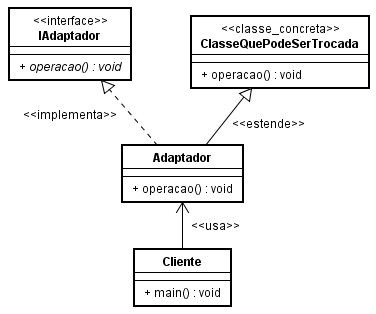

**Proxy** 

> Intenção: fornecer um substituto ou marcador da localização de outro objeto para controlar o acesso a esse objeto.

A ideia é inserir uma classe substituta no meio do caminho para por exemplo, carregamento tardio (lazzy loading).

Essa estratégia é utilizada por ORMs para realizar carregamento tardio de propriedades/relacionamentos.

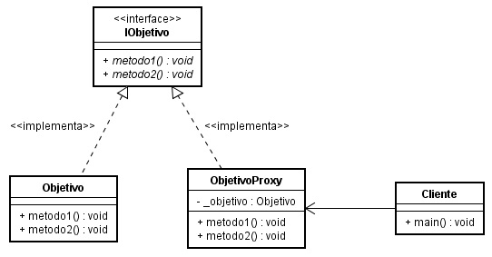

A classe proxy não é uma cópia da classe objetivo, ela é uma "fachada" que representa a classe objetivo. Os métodos da classe proxy simplesmente repassam a chamada para os métodos da instância _objetivo que proxy possui como membro privado. O legal desta estratégia é que a instância _objetivo só precisa ser carregada quando cliente acionar um método de proxy. Isso ajuda a economizar memória e tira de cliente a responsabilidade de controlar essa questão.

**Composite**

> Intenção: compor objetos em estruturas de árvore para representar hierarquia partes-todo. Composite permite aos clientes tratarem de maneira uniforme objetos individuais e composições de objetos.

Pode ser utilizado para lidar com contextos de hierarquia de classes de uma mesma família que pode ser representada e tratada de forma recursiva.

Um exemplo é a representação de um sistema de arquivos onde temos arquivos e diretórios que são arquivos especiais que podem apontar para outros arquivos. 

**Flyweight**

> Intenção: usar compartilhamento para suportar eficientemente grandes quantidades de objetos de granularidade fina. 

A ideia é promover o uso mais eficiente da memória através da redução de instâncias de mesmo tipo quando isso é possível.

O padrão é muito utilizado em aplicações que manipulam uma grande quantidade de objetos repetidos e compartilháveis para economizar memória através do cache de objetos.

A ideia é que a classe cliente solicite a uma classe agregadora o objeto desejado, essa classe agregadora antes de instanciar verifica em sua lista se o objeto já foi usado, se não foi usado, instancia, guarda na lista e devolve, se já foi usado apenas devolve. 

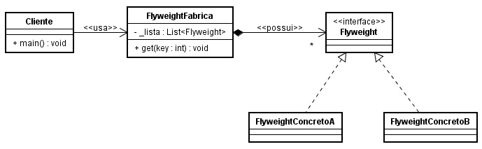

**Bridge** (Ponte)

> Intenção: desacoplar uma abstração da sua implementação, de modo que as duas possam variar independentemente.

Apesar de deixar o sistema mais complexo o padrão promove uma enorme flexibidade, pois você pode variar a abstração e pode variar também a sua implementação. 

Para que seja possível essa flexibidade o padrão define entre a implementação e a abstração uma interface (contrato).

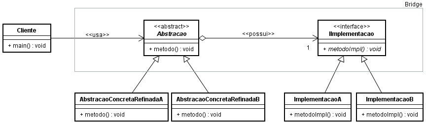

**Decorator**

> Intenção: dinamicamente, agregar responsabilidades adicionais a objetos. Os Decorators fornecem uma alternativa flexível ao uso de subclasses para extensão de funcionalidades.

Java, C# assim como outras tecnologias não implementam herança múltipla. Decorator se baseia em recursos comuns da orientação a objetos para alcançar seus objetivos, e por isso é possível obter herança múltipla em tecnologias que não implementam o recurso.

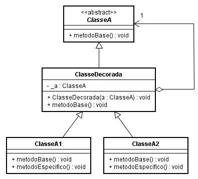

A ideia é partir de uma classe base abstrata com comportamento comum/base, estender essa classe base e nesta subclasse receber no construtor uma instância da classe base. Nos métodos sobrescritos é que ocorrem a "mágica" (herança múltipla), pois a subclasse tem como membro uma instância da classe base e aí podemos acionar métodos desta instância base e também podemos acionar métodos da instância filho. Ao estender ou utilizar uma classe filha obtemos múltiplos comportamentos.

Além de nos permitir simular "herança múltipla" com Decorator conseguimos adicionar/trocar comportamento em tempo de execução para uma dada classe.

---

**Visitor** (Visitante)

> Intenção: representar uma operação a ser executada nos elementos de uma estrutura de objetos. Visitor permite definir uma nova operação sem mudar as classes dos elementos sobre os quais opera.

A ideia é passar a complexidade operacional de um objeto para outros objetos, ou seja, é separar as operações de um objeto de sua representação. Em vez do próprio objeto manipular seus dados deve-se passar/autorizar/encarregar/delegar para outros objetos cada tipo de manipulação/operação.

Portanto gera-se várias classes e isso facilita a modificação. Fica mais fácil modificar uma classe específica sem alterar as demais e fica mais fácil também a modificação de várias classes em paralelo por uma equipe.

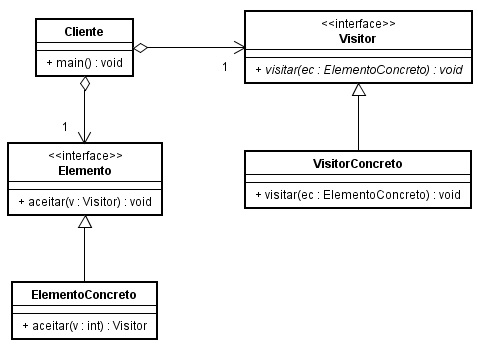

ElementoConcreto aceita Visitor e por isso podemos passar ElementoConcreto para Visitor operar sobre ElementoConcreto. VisitorConcreto que realiza Visitor é quem opera sobre ElementoConcreto. Perceba que agora ElementoConcreto não precisa resolver todos os problemas sozinho, ele pode aceitar vários Visitors e compartilhar com estes os seus problemas, ou seja, podemos ter vários Visitors concretos resolvendo vários problemas de ElementoConcreto.

**Template Method** (Método Modelo)

> Intenção: definir o esqueleto de um algoritmo em uma operação, postergando alguns passos para as subclasses. Template Method permite que subclasses redefinam certos passos de um algoritmo sem mudar a estrutura do mesmo.

A ideia é extrair de uma rotina principal para outras rotinas abstratas, instruções que mudam ou podem mudar com frequencia, sem afetar a rotina principal.

Deixa a rotina principal mais clara/limpa e separa as responsabilidades. Isso facilita a manutenção.

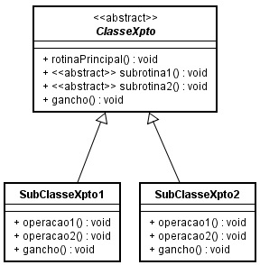

**Command**

> Intenção: encapsular uma solicitação como objeto, desta forma permitindo parametrizar cliente com diferentes solicitações, enfileirar ou fazer o registro de solicitações e suportar operações que podem ser desfeitas.

A ideia é substituir operações/instruções por classes de comando tornando o sistema mais flexível à mudanças. Command desacopla o objeto que invoca a operação daquele que sabe como executá-la.

Outra vantagem é que a operação comando=classe pode ser armazenada em uma fila e executada quando melhor convir.

De acordo com o padrão GOF, a classe CommandConcrete deve receber em seu construtor o Receiver (que sabe como resolver o problema) e acionar Receiver nos métodos execute e undo. Além disso Client deve definir qual Receiver sabe resolver o problema, deve definir os comandos necessários (CommandConcrete) passando Receiver como parâmetro, deve ainda definir um Controler/Invoker que armazena os commands e ao ser acionado sabe qual command deve ser acionado. Portanto o padrão GOF define um Controller/Invoker para controlar/invocar os comandos.

Podemos também tirar o controlador da estrutura. Neste caso quem exerce o controle é o próprio cliente. Essa estratágia é mais simples e se encaixa em projetos mais simples.

_Essa ideia de substituir operações por classes diminui o número de condições de um software e isso é bom, pois devemos evitar o número excessivo de "ifs" em um software. Quebrar uma rotina em pequenas instruções e leva-las para classes específicas e pequenas ajuda no desacomplamento._ 

Muito utilizado em contextos de execução remota, registro de log (logging) e transações/históricos, contextos de operações fazer/desfazer.

**Strategy/Policy** (Política)

> Intenção: definir uma família de algoritmos, encapsular cada uma delas e torná-las intercambiáveis. Strategy permite que o algoritmo varie independentemente dos clientes que o utilizam.

A ideia é extrair políticas/funções estratégicas de um contexto por meio de classes abstratas ou interfaces tornando a manutenção mais flexível. Não é preciso alterar o contexto todo, basta alterar as classes concretas ou implementar novas classes concretas.

O padrão é muito utilizado na definição de interfaces repositórios (IRepository) em aplicações que lidam com vários contextos de repositórios ou bancos de dados. Também muito utilizado para inserir comportamentos falsos em testes de software (Mock).

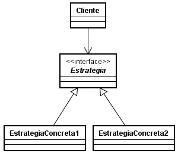

**Observer** 

> Intenção: definir uma dependência um para muitos entre objetos, de maneira que quando um objeto muda de estado todos os seus dependentes são notificados e atualizados automaticamente.

A ideia é tirar do cliente a responsabilidade de ficar esperando por mudanças (em loop) e assim evitar que a aplicação fique por um longo tempo inacessível ao usuário ou tenha que lidar com esta complexidade.

Muito utilizado na implementação de eventos em aplicações Windows Forms para evitar que a aplicação (thread principal) fique inacessível enquanto uma ou várias operações executam em paralelo (em outras threads).

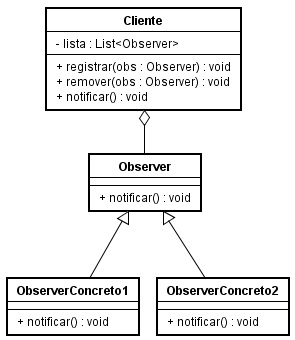

**Mediator** (Mediador/Moderador)

> Intenção: definir um objeto mediador que encapsula a forma como um conjunto de objetos colegas interagem. O Mediator promove o fraco/baixo acoplamento ao evitar que os objetos colegas se refiram uns aos outros explicitamente e ao permitir variar suas interações independentemente. 

Assim como em banco de dados quando temos uma relação muitos para muitos usamos a estratégia de definir uma tabela intermediária, em orientação a objetos e em certos contextos, essa estratégia é também uma prática indicada. É justamente isso que o Mediator trata.

Pode ser usado em aplicações para enviar mensagens em broadcast aos componentes/agentes ativos.

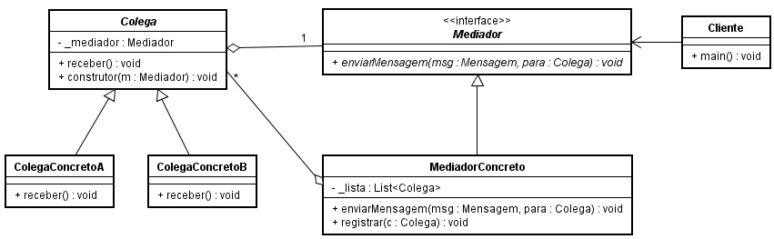

Repare que o Cliente apenas pede para o Mediador enviar a mensagem para um dado Colega e portanto se exime desta responsabilidade. É o MediadorConcreto que assume a responsabilidade de lidar com a complexidade de enviar a mensagem para o devido Colega.

Nem sempre é possível realizar comunicação entre objetos por meio de mensagens padrões (protocolos). Mas quando este for o caso o Mediator é um ótimo padrão para prover reuso e fraco acoplamento.

Entretanto em termos práticos a tendência é que o objeto Mediador se torne complexo. Portanto deve-se avaliar isso também e mesclar a solução com outros padrões.

**Memento**

> Intenção: sem violar o encapsulamento, capturar e externalizar um estado interno de um objeto, de maneira que o objeto possa ser restaurado para esse estado mais tarde.

A ideia é definir uma classe (Memento) responsável por salvar o estado de um objeto (Originador) desejado e uma outra classe (Armazenadora) que fica responsável por armazenar todas as cópias de mementos.

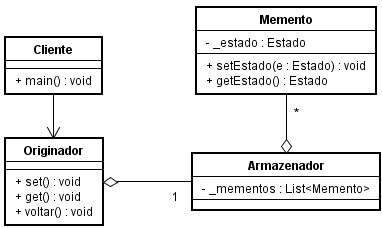

Pode ser utilizado em aplicações como editores de texto, editores de imagens e editores em geral.

**State** (Estado)

> Intenção: permite a um objeto alterar seu comportamento quando seu estado interno muda. O objeto parecerá ter mudado de classe.

A ideia é representar estados de um objeto por outros objetos. Em vez de inserir complexidade no tratamento de estado o padrão nos propõe a invocação de métodos em objetos de estado (que possuem a inteligência necessária para lidar com o estado).

Muito utilizado em jogos SideScrool como Super Mario Bros de Donkey Kong Quest onde a cada evento o personagem assume um estado.

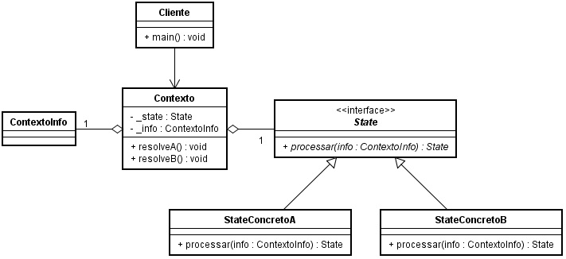

Repare que Cliente aciona Contexto para resolver um problema, Contexto aciona o StateConcreto devido passando ContextoInfo, por sua vez StateConcreto com base em ContextoInfo processa e devolve o "novo" State.

**Chain of Responsibility** (Cadeia de Responsabilidades)

> Intenção: evitar o acoplamento do remetente de uma solicitação ao seu receptor, ao dar a mais de um objeto a oportunidade de tratar a solicitação. Encadear os objetos receptores, passando a solicitação ao longo da cadeia até que um objeto a trate.

Uma boa prática para remover a complexidade de uma rotina, promover fraco acoplamento e a manutenibilidade é substituir os possíveis caminhos por classes. Entretanto com essa substituição ainda temos decisões sendo tomadas no solicitante.

A ideia do padrão é tirar do solicitante a responsabilidade de decidir qual objeto receptor deve responder. Para isso ele propõe a utilização de uma cadeia de objetos receptores. O solicitante faz a solicitação para o primeiro receptor da cadeia, se ele pode responder ele responde, se não pode passa a solicitação para o próximo da cadeia, o próximo faz o mesmo e se for necessário passa a solicitação para o próximo até que algum receptor resolva a solicitação ou até que se chegue ao final da cadeia.

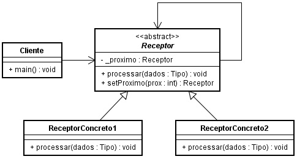

**Iterator** 

> Intenção: fornecedor um meio de acessar, sequencialmente, os elementos de um objeto agregado sem expor sua representação subjacente.

A maiorias das tecnologias/linguagens já oferecem iterators.

**Interpreter** (Interpretador de Linguagem)

> Intenção: dada uma linguagem, definir uma representação para sua gramática juntamente com um interpretador que usa a representação para interpretar sentenças dessa linguagem.

--- 

**Fontes** 
- https://pt.wikipedia.org/wiki/Padr%C3%A3o_de_projeto_de_software
- https://brizeno.wordpress.com/category/padroes-de-projeto/
- https://www.youtube.com/watch?v=8vyfyPFhRUE (Giovanni Bassi)
- https://www.youtube.com/watch?v=gEGLVMY-ifA&list=PLc3ShgoNmIijcDnXTnQtdHAQMwn_t7aM1 (IFES - Colatina ES) 
- https://www.youtube.com/watch?v=iuavQrvKOO8&list=PLDm7BSK-M5YnGCOqOO9NEMEx4VHHOQZLY  