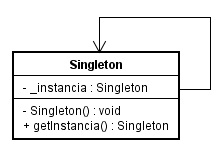
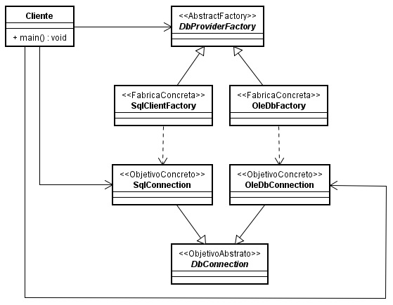
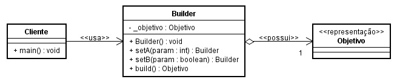

# Padrões de Projeto GOF (23)

Em Engenharia de Software, um padrão de projeto (design pattern) é uma solução geral para um problema que ocorre com frequência dentro de um determinado contexto no projeto de software. Um padrão de projeto não é um projeto finalizado que pode ser diretamente transformado em código fonte ou de máquina, ele é uma descrição ou modelo (template) de como resolver um problema que pode ser usado em muitas situações diferentes. Padrões são boas práticas formalizadas que o programador pode usar para resolver problemas comuns ao projetar uma aplicação ou sistema **e principalmente promover o fraco acoplamento e a reutilização de código**. Um padrão de projeto define: seu nome, o problema, quando aplicar esta solução e suas consequências.
  
- Classificação por Finalidade
    - **Padrões de Criação**: tratam da definição de classes criadoras de objetos com o objetivo de abstrair a complexidade da criação e separar a rotina de criação de um objeto de sua representação ou de adiar o processo de criação.
        - Singleton
        - Factory Method
        - Abstracty Factory
        - Builder
        - Prototype

--- 

**Singleton**  

> **Intenção**: garantir que uma classe tenha somente uma instância e forneça somente um ponto global de acesso para a mesma.  

Para isso devemos definir uma classe com o construtor privado, um atributo estático privado e somente leitura do mesmo tipo da classe para guardar a instância e um método estático público que retorna a única instância da classe.

**Factory Method** (Método Fábrica)  

> Intenção: definir uma interface para criar um objeto, mas deixar as subclasses decidirem que classe instanciar. O Factory Method permite adiar a instanciação para subclasses.

O Factory Method ajuda a tirar o **new** da classe cliente e com isso ajuda a dimiuir o acoplamento. _Toda vez que usamos o **new** estamos promovendo acoplamento (dependência) e o ideal é evitar que uma classe ou um método fiquem fortemente acoplados._

A ideia é adiar a instanciação às subclasses e passar o acoplamento para métodos utilitários criadores.

Podemos utilizar o padrão na íntegra, conforme definido por GOF, que consiste na definição de um método criador abstrato em uma classe abstrata de criação. Isso nos obriga a estender e a implementar, o que torna a rotina de criação mais flexível. Porém podemos utilizar uma estratégia (que não é um padrão) chamada de **SimpleFactory** que consiste na simples definição de uma classe criadora com um método criador concreto que devolve uma instância com base em parâmetros recebidos e em decisões internas. Essa estratégia, por ser mais simples, é muito usada, mas não é um padrão GOF e sim uma derivação deste.

No caso do padrão proposto por GOF, como se propõe a definição de um método abstrato, o correto é que o método abstrato Factory Method também faça referência (fique acoplado) a classes abstratas, deixando o acomplamento concreto para classes concretas.

Este padrão é muito utilizado em conjunto ao padrão Singleton para gerenciar a instanciação de conexões.

**Abstract Factory** (Classe Fábrica)

> Intenção: fornecer uma interface para criação de famílias de objetos relacionados ou dependentes sem especificar suas classes concretas.

A classe fábrica (AbstractFactory) não conhece os objetos concretos. Ela apenas fornece um contrato único entre a classe cliente e várias classes fábricas concretas que estendem/implementam a AbstractFactory.

Encontramos esse padrão no .NET nas seguintes classes:

**Builder**  

> Intenção: separar a construção de um objeto complexo de sua representação de modo que o mesmo processo de construção possa criar diferentes representações.

A ideia é quebrar a rotina de criação de um objeto complexo em vários métodos e colocar entre Cliente e o Objetivo uma classe Builder (construtora).

O Android SDK utiliza uma variação (mais simples e mais prática) deste padrão, que podemos chamar de **SimpleBuilder**. Um exemplo é a criação de uma notificação. Para obter uma notificação (que é o nosso objetivo) temos que usar uma classe Builder que expõe vários métodos _set_ e também um método final que retorna o objetivo. 

Com este padrão fica fácil variar a construção de objetos e como somente o método final devolve o objeto/objetivo, podemos realizar no final validações importantes.

Vejamos como ficaria o SimpleBuilder:

**Prototype** 

> Intenção: especificar tipos de objetos a serem criados usando uma instância protótipo e criar novos objetos pela cópia desse protótipo.

Torna o processo de criação mais eficiente, esconde (desacopla) os produtos/objetivos do cliente e oferece mais flexibidade para alterações nas classes produtos/objetivos.

A ideia é evitar a instanciação de objetos com _new_ e realizar _clones_ de um protótipo a partir de uma implementação que estende o protótipo.

Se a tecnologia já oferece recursos de _clonagem_, como Java e Javascript, além de tornar o processo de "criação" mais rápido e eficiente, fica fácil utilizar o padrão. Se a tecnologia não oferece, somos obrigados a simular e neste caso não temos ganho de velocidade, mas mesmo assim temos vantagens ao promover o desacoplamento.

--- 
**Fontes** 
- https://pt.wikipedia.org/wiki/Padr%C3%A3o_de_projeto_de_software
- https://brizeno.wordpress.com/category/padroes-de-projeto/
- https://www.youtube.com/watch?v=8vyfyPFhRUE (Giovanni Bassi)
- https://www.youtube.com/watch?v=gEGLVMY-ifA&list=PLc3ShgoNmIijcDnXTnQtdHAQMwn_t7aM1 (IFES - Colatina ES) 
- https://www.youtube.com/watch?v=iuavQrvKOO8&list=PLDm7BSK-M5YnGCOqOO9NEMEx4VHHOQZLY  